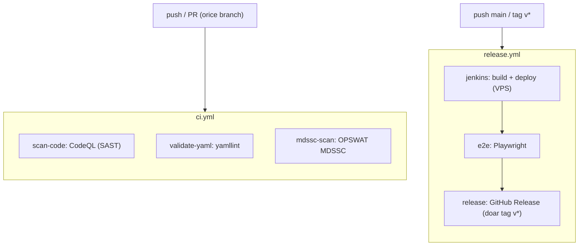
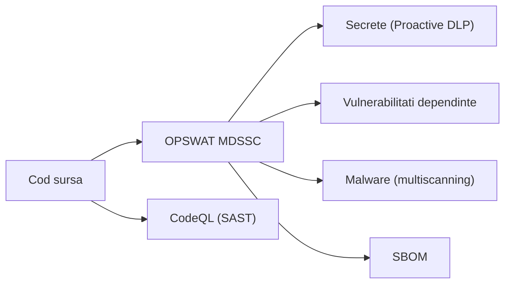

# Workflows CI/CD (GitHub Actions)

Stratul exterior de orchestrare din `.github/workflows/`. GitHub Actions declanseaza totul; Jenkins ramane pipeline-ul interior (build + deploy), apelat din `release.yml`. Securitatea se bazeaza pe OPSWAT MetaDefender Software Supply Chain (MDSSC).

## Fluxul

## Fisierele

| Fisier | Trigger | Ce face |
|---|---|---|
| `ci.yml` | push (toate branch-urile) + PR + cron saptamanal | CodeQL (SAST), validare YAML, scanare OPSWAT MDSSC |
| `release.yml` | push `main` + tag `v*` | trigger Jenkins (build+deploy) -> E2E -> GitHub Release (la tag) |

## Securitate — OPSWAT MDSSC ca scanner principal

`mdssc-scan` ruleaza containerul oficial `opswat/mdssc-scanner` si acopera secrete, vulnerabilitati, malware si SBOM. CodeQL ramane pentru SAST (analiza statica a codului), lucru pe care MDSSC nu il face. Toate workflow-urile pastreaza least-privilege `permissions`, `timeout-minutes`, `concurrency` si actiuni pinuite la SHA.

## Scope

- Acoperit aici: toate workflow-urile GitHub Actions + badge-urile din `README.md`.
- In afara acestui strat: Jenkinsfile / webhook, infra VPS, testele E2E si scanarile din Jenkins (alte parti ale proiectului).

## De stiut

- `mdssc-scan` are nevoie de secretele `MDSSC_SERVER` + `MDSSC_API_KEY` in repo, iar serverul MDSSC trebuie sa fie accesibil de pe runner-ul GitHub (de preferat HTTPS).
- Pentru a evita rate-limit-ul anonim Docker Hub (10 pull-uri/ora/IP) la `opswat/mdssc-scanner`, se pot adauga optional secretele `DOCKERHUB_USERNAME` + `DOCKERHUB_TOKEN`.
- Scanarea va semnala secretele commit-uite (`backend/.env`, `docker-compose.yml`) — remedierea (rotire + scos din istoric) ramane in sarcina echipei.
