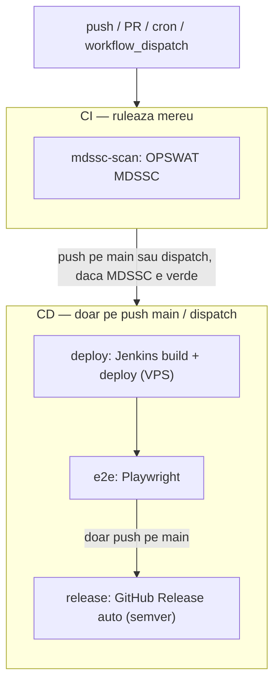
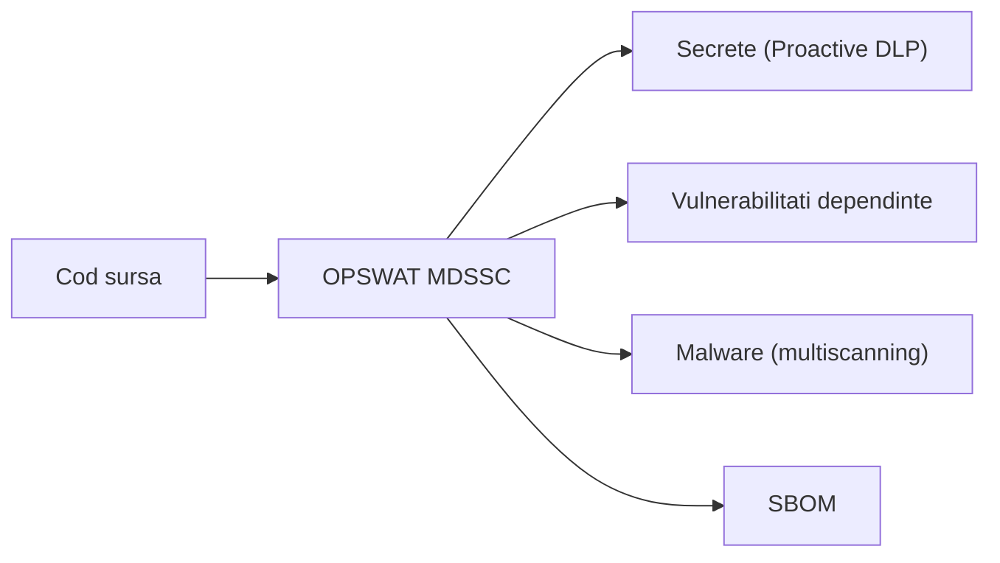

# Workflow CI/CD (GitHub Actions)

Un **singur** workflow, `.github/workflows/cicd.yml`, orchestreaza totul. GitHub Actions declanseaza fluxul; Jenkins ramane pipeline-ul interior (build + deploy), apelat din job-ul `deploy`. Securitatea se bazeaza pe OPSWAT MetaDefender Software Supply Chain (MDSSC). Release-urile sunt **complet automate** (versiune semver calculata singura), fara tag-uri `v*` introduse manual.

## Fluxul

## Job-urile (un singur fisier, conditionate cu `if:`)

| Job | Cand ruleaza | Ce face |
|---|---|---|
| `mdssc-scan` | orice push / PR / cron / dispatch | OPSWAT MDSSC (secrete, vuln, malware, SBOM) |
| `deploy` | push pe `main` sau `workflow_dispatch`, dupa ce **scanarea MDSSC** e verde | trigger Jenkins (build + deploy VPS) |
| `e2e` | dupa `deploy` | teste Playwright pe VPS-ul deployat |
| `release` | push pe `main`, dupa `e2e` | creeaza automat tag + GitHub Release (semver) |

Trigger-e: `push` (toate branch-urile), `pull_request`, `schedule` (zilnic 03:27 UTC), `workflow_dispatch` (manual / pentru integrare in pipeline-uri mai mari).

CD-ul depinde de CI prin `needs: [mdssc-scan]` — deploy-ul nu porneste daca scanarea MDSSC pica. Pe `main`, `concurrency` nu intrerupe un deploy in curs; pe celelalte branch-uri rularile vechi se anuleaza.

## Release automat (fara tag-uri manuale)

Job-ul `release` calculeaza singur urmatoarea versiune pornind de la ultimul tag `vX.Y.Z`, in functie de mesajul ultimului commit (conventional commits):

- `BREAKING CHANGE` sau `!:` -> bump **major**
- mesaj care incepe cu `feat` -> bump **minor**
- altfel -> bump **patch**

Apoi `softprops/action-gh-release` creeaza tag-ul + GitHub Release-ul (cu note generate automat). **Nu trebuie sa dai tu push la `v*`.**

> Nota: un Release creat cu `GITHUB_TOKEN` nu redeclanseaza alt workflow in acelasi repo (protectie anti-bucla). Daca pe viitor vrei ca un Release sa porneasca alt workflow / pipeline mai mare, foloseste un PAT dedicat sau `repository_dispatch`.

## Securitate — OPSWAT MDSSC ca scanner principal

`mdssc-scan` ruleaza containerul oficial `opswat/mdssc-scanner` si acopera secrete, vulnerabilitati, malware si SBOM. Workflow-ul pastreaza least-privilege `permissions`, `timeout-minutes`, `concurrency` si actiuni pinuite la SHA.

> **SAST — in afara scopului (posibil feature viitor).** Proiectul curent este un PoC (proof of concept) axat pe integrarea MDSSC, asa ca securitatea se bazeaza exclusiv pe MDSSC. Analiza statica de cod (SAST, ex. CodeQL) si validarea YAML (yamllint) au fost scoase intentionat; SAST va fi cel mai probabil adaugat ca feature separat in viitor, insa nu intra in scopul nostru.

## Scope

- Acoperit aici: workflow-ul GitHub Actions `cicd.yml` + badge-ul din `README.md`.
- In afara acestui strat: Jenkinsfile / webhook, infra VPS, testele E2E si scanarile din Jenkins (alte parti ale proiectului).
- In afara scopului (PoC), posibil feature viitor: SAST / analiza statica de cod (ex. CodeQL) si validarea YAML (yamllint) — nu le acoperim noi in proiectul curent.

## De stiut

- `mdssc-scan` are nevoie de secretele `MDSSC_SERVER` + `MDSSC_API_KEY` in repo, iar serverul MDSSC trebuie sa fie accesibil de pe runner-ul GitHub (de preferat HTTPS).
- `deploy` are nevoie de secretele Jenkins: `JENKINS_VPS_URL`, `JENKINS_USER`, `MDSSC_JENKINS_API_TOKEN`, `JENKINS_REMOTE_TOKEN`. `e2e` are nevoie de `VPS_BASE_URL`.
- `release` depinde de `e2e`, care ruleaza testele din folderul `e2e/` (de livrat de Mario). Pana cand `e2e/` exista, lantul nu ajunge la pasul de release.
- Pentru a evita rate-limit-ul anonim Docker Hub (10 pull-uri/ora/IP) la `opswat/mdssc-scanner`, se pot adauga optional secretele `DOCKERHUB_USERNAME` + `DOCKERHUB_TOKEN`.
- Scanarea va semnala secretele commit-uite (`backend/.env`, `docker-compose.yml`) — remedierea (rotire + scos din istoric) ramane in sarcina echipei.
